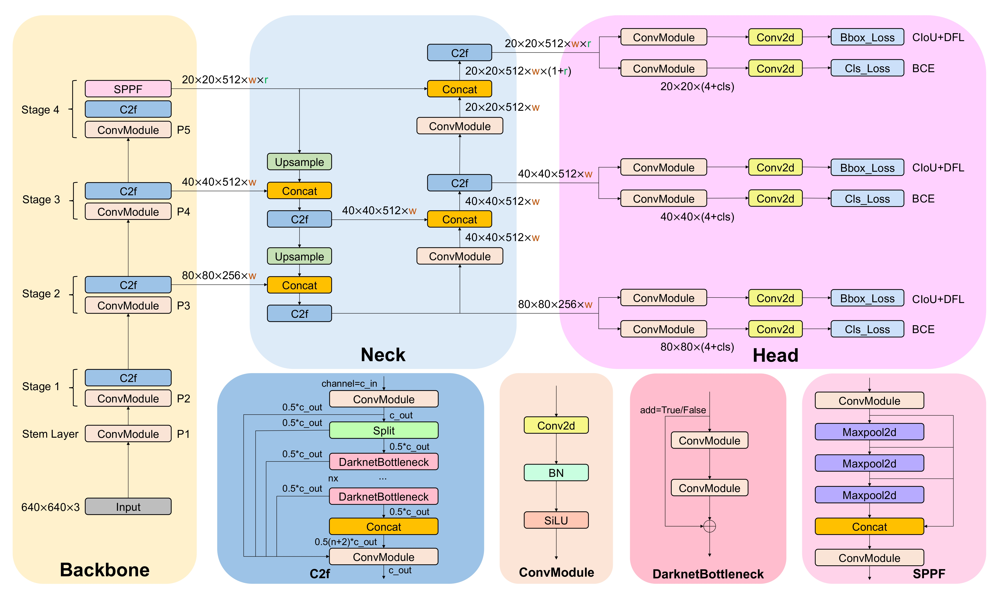
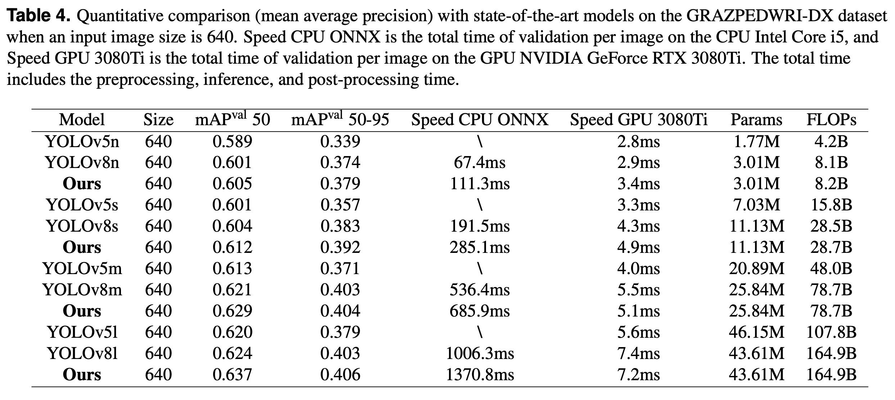
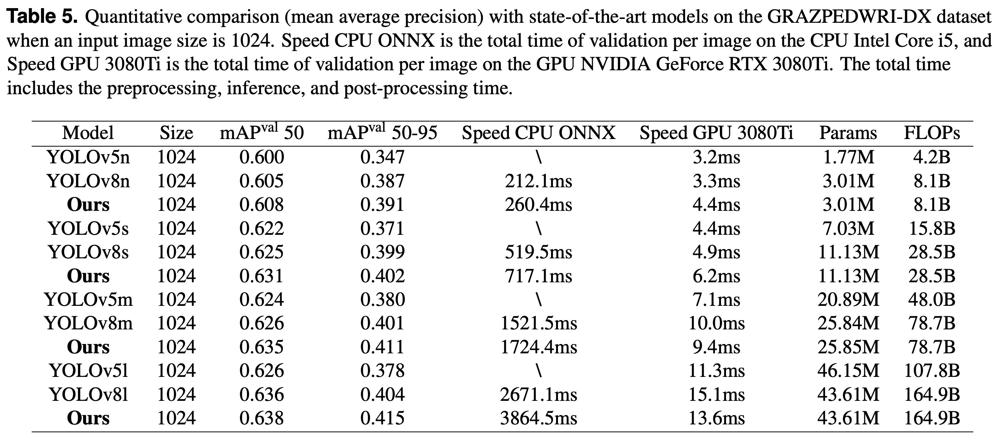
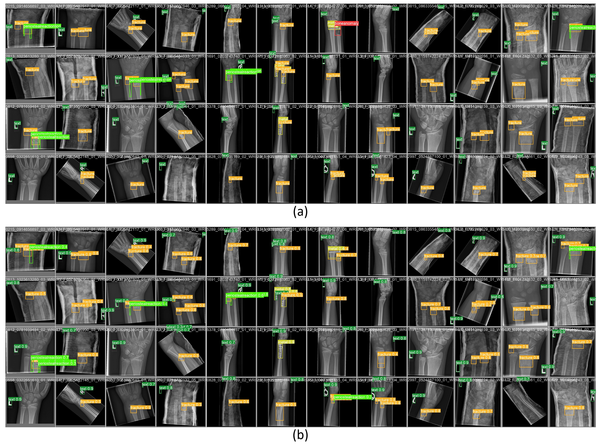
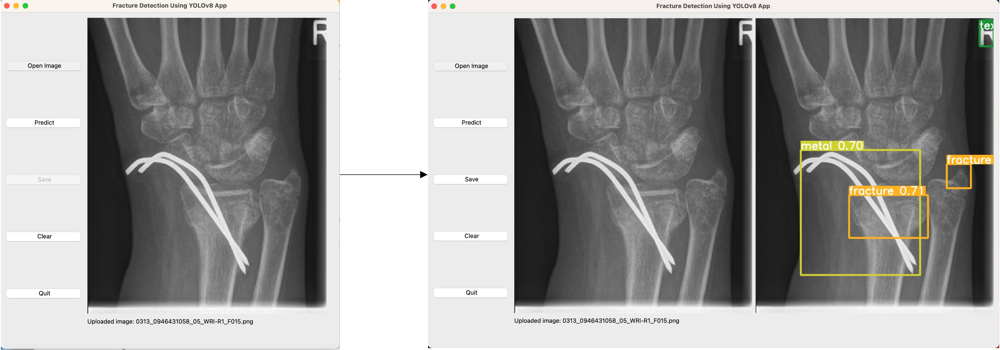

# Fracture Detection in Pediatric Wrist Trauma X-ray Images Using YOLOv8 Algorithm

>[Fracture Detection in Pediatric Wrist Trauma X-ray Images Using YOLOv8 Algorithm](https://arxiv.org/abs/2304.05071)

[](https://paperswithcode.com/sota/object-detection-on-grazpedwri-dx?p=fracture-detection-in-pediatric-wrist-trauma)

## Abstract
Hospital emergency departments frequently receive lots of bone fracture cases, with pediatric wrist trauma fracture accounting for the majority of them. Before pediatric surgeons perform surgery, they need to ask patients how the fracture occurred and analyze the fracture situation by interpreting X-ray images. The interpretation of X-ray images often requires a combination of techniques from radiologists and surgeons, which requires time-consuming specialized training. With the rise of deep learning in the field of computer vision, network models applying for fracture detection has become an important research topic. In this paper, we train YOLOv8 (the latest version of You Only Look Once) model on the GRAZPEDWRI-DX dataset, and use data augmentation to improve the model performance. The experimental results show that our model have reached the state-of-the-art (SOTA) real-time model performance. Specifically, compared to YOLOv8s models, the mean average precision (mAP 50) of our models improve from 0.604 and 0.625 to 0.612 and 0.631 at the input image size of 640 and 1024, respectively. To enable surgeons to use our model for fracture detection on pediatric wrist trauma X-ray images, we have designed the application "Fracture Detection Using YOLOv8 App" to assist surgeons in diagnosing fractures, reducing the probability of error analysis, and providing more useful information for surgery.

### YOLOv8 architecture
<p align="center">
  
</p>

## Citation
If you find our paper useful in your research, please consider citing:

    @article{ju2023fracture,
      title={Fracture Detection in Pediatric Wrist Trauma X-ray Images Using YOLOv8 Algorithm},
      author={Ju, Rui-Yang and Cai, Weiming},
      journal={arXiv preprint arXiv:2304.05071},
      year={2023}
    }
    
## Requirements
* Linux (Ubuntu)
* Python = 3.9
* Pytorch = 1.13.1
* NVIDIA GPU + CUDA CuDNN

## Environment
```
  pip install -r requirements.txt
```

## Dataset
### Dataset Split
* GRAZPEDWRI-DX Dataset [(Download Link)](https://figshare.com/articles/dataset/GRAZPEDWRI-DX/14825193)
* Download dataset and put images and annotatation into `./GRAZPEDWRI-DX_dataset/data/images`, `./GRAZPEDWRI-DX_dataset/data/labels`.
  ```
    python split.py
  ```
* The dataset is divided into training, validation, and testing set (70-20-10 %) according to the key `patient_id` stored in `dataset.csv`.
* The script then will move the files into the relative folder as it is represented here below.


       GRAZPEDWRI-DX_dataset
          └── data   
               ├── meta.yaml
               ├── images
               │    ├── train
               │    │    ├── train_img1.png
               │    │    └── ...
               │    ├── valid
               │    │    ├── valid_img1.png
               │    │    └── ...
               │    └── test
               │         ├── test_img1.png
               │         └── ...
               └── labels
                    ├── train
                    │    ├── train_annotation1.txt
                    │    └── ...
                    ├── valid
                    │    ├── valid_annotation1.txt
                    │    └── ...
                    └── test
                         ├── test_annotation1.txt
                         └── ...


The script will create 3 files: `train_data.csv`, `valid_data.csv`, and `test_data.csv` with the same structure of `dataset.csv`.

### Data Augmentation
* Data augmentation of the training set using the addWeighted function doubles the size of the training set.
```
  python imgaug.py --input_img /path/to/input/train/ --output_img /path/to/output/train/ --input_label /path/to/input/labels/ --output_label /path/to/output/labels/
```
For example:
```
  python imgaug.py --input_img ./GRAZPEDWRI-DX/data/images/train/ --output_img ./GRAZPEDWRI-DX/data/images/train_aug/ --input_label ./GRAZPEDWRI-DX/data/labels/train/ --output_label ./GRAZPEDWRI-DX/data/labels/train_aug/
```

* The path of the processed file is shown below:

       GRAZPEDWRI-DX_dataset
          └── data   
               ├── meta.yaml
               ├── images
               │    ├── train
               │    │    ├── train_img1.png
               │    │    └── ...
               │    ├── train_aug
               │    │    ├── train_aug_img1.png
               │    │    └── ...
               │    ├── valid
               │    │    ├── valid_img1.png
               │    │    └── ...
               │    └── test
               │         ├── test_img1.png
               │         └── ...
               └── labels
                    ├── train
                    │    ├── train_annotation1.txt
                    │    └── ...
                    ├── train_aug
                    │    ├── train_aug_annotation1.txt
                    │    └── ...
                    ├── valid
                    │    ├── valid_annotation1.txt
                    │    └── ...
                    └── test
                         ├── test_annotation1.txt
                         └── ...
                         
## Model
You can get the open source code of YOLOv8 through [YOLOv8 official GitHub](https://github.com/ultralytics/ultralytics).
### Train
Before training the model, make sure the path to the data in the `meta.yaml` file is correct.
* meta.yaml
```
  # patch: /path/to/GRAZPEDWRI-DX/data
  path: 'E:/GRAZPEDWRI-DX/data'
  train: 'images/train_aug'
  val: 'images/valid'
  test: 'images/test'
```

* Arguments

| Key | Value | Description |
| :---: | :---: | :---: |
| model | None | path to model file, i.e. yolov8n.pt, yolov8n.yaml |
| data | None | path to data file, i.e. coco128.yaml |
| epochs | 100 | number of epochs to train for |
| patience | 50 | epochs to wait for no observable improvement for early stopping of training |
| batch | 16 | number of images per batch (-1 for AutoBatch) |
| imgsz | 640 | size of input images as integer, i.e. 640, 1024 |
| save | True | save train checkpoints and predict results |
| device | None | device to run on, i.e. cuda device=0 or device=0,1,2,3 or device=cpu |
| workers | 8 | number of worker threads for data loading (per RANK if DDP) |
| pretrained | True | (bool or str) whether to use a pretrained model (bool) or a model to load weights from (str) |
| optimizer | 'auto' | optimizer to use, choices=SGD, Adam, Adamax, AdamW, NAdam, RAdam, RMSProp, auto |
| resume | False | resume training from last checkpoint |
| lr0 | 0.01 | initial learning rate (i.e. SGD=1E-2, Adam=1E-3) |
| momentum | 0.937 | 	SGD momentum/Adam beta1 |
| weight_decay | 0.0005 | optimizer weight decay 5e-4 |
| val | True | validate/test during training |

* Example
```
  cd Bone_Fracture_Detection_YOLOv8
  yolo train model=yolov8n.pt data=./GRAZPEDWRI-DX/data/meta.yaml epochs=100 batch=16 imgsz=640 save=True device=0 workers=4 pretrained=yolov8n.pt optimizer=SGD lr0=0.01
```

### Trained Model
Use gdown to download the trained model from our GitHub:
```
  gdown https://github.com/RuiyangJu/Bone_Fracture_Detection_YOLOv8/releases/download/Trained_model/best.pt
```

### Validate 
* Arguments

| Key | Value | Description |
| :---: | :---: | :---: |
| data | None | path to data file, i.e. coco128.yaml |
| imgsz | 640 | size of input images as integer, i.e. 640, 1024 |
| batch | 16 | number of images per batch (-1 for AutoBatch) |
| save_json | False | save results to JSON file |
| save_hybrid | False | save hybrid version of labels (labels + additional predictions) |
| conf | 0.001 | object confidence threshold for detection |
| iou | 0.6 | intersection over union (IoU) threshold for NMS |

* CLI
```
  yolo val model=/path/to/best.pt data=/path/to/meta.yaml
```

## Experimental Results

<p align="center">
  
</p>

<p align="center">
  
</p>

<p align="center">
  
</p>
The prediction examples of our model on the pediatric wrist trauma X-ray images. (a) the manually labeled images, (b) the predicted images.

## Application
For research project agreement, we don't release APP code, please refer to [YOLOv7 Bone Fracture Detection](https://github.com/mdciri/YOLOv7-Bone-Fracture-Detection) and our paper for details.

### Fracture Detection Using YOLOv8 App
<p align="center">
  
</p>
